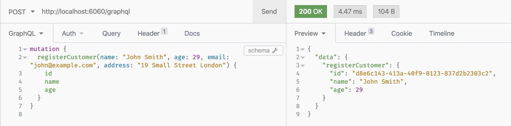
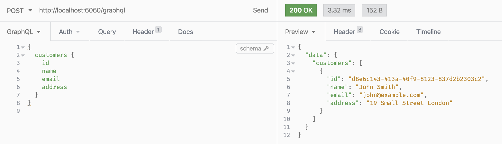

# juniper-demo

Forked from https://github.com/joshua-cooper/rust-graphql-intro, just for study purpose.

To run locally after adjusting the connection string in the .env file.

```
sh local-db.sh      (this starts DB in your local docker.)
sh local-start.sh   (from another terminal)
```

To run in your local docker after adjusting the connection string in the .env file.

```
sh run.sh    
```


